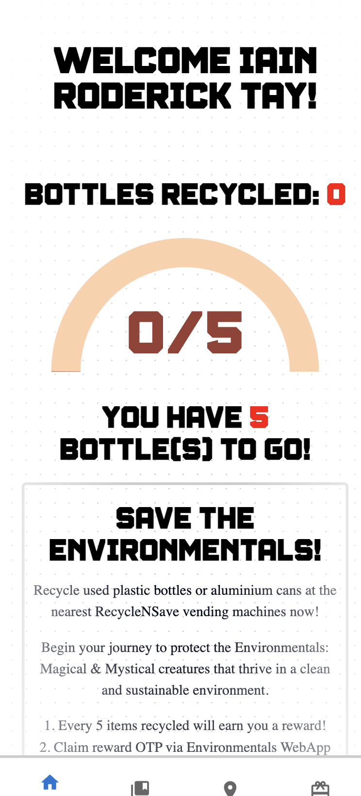

# iNTUition v10.0 - Team BluTech

# Environmentals   _"Recycle, Rescue, Reign: Unleash the Power of Environmentals!"_   

---

  
	
	
	
	
	
	
	
	
	
	

    
    

### Team Members of BluTech:

- [Oscar Qian](https://github.com/oscarqjh)
- [Iain Roderick Tay](https://github.com/eeyearn)
- [Lee Cheng Yao](https://github.com/chengyaolee)
- [Zane Yee Sun](https://github.com/zazzane)

### Website Link: https://environmentals.vercel.app/

### Video Demo Link: https://youtu.be/cP5oUKL51ws

---

## Inspiration
Our inspiration for Environmentals came from our shared passion for environmental conservation and our love for gaming. To raise awareness for recycling initiatives in Singapore, we are gamifying the recycling process to incentivise Singaporeans through the collection of pet avatars. Being an aggregator platform for initiatives such as SGRecycle, RecycleNSave and ALBA E-waste, we are adding a layer of fun and excitement to the process of recycling, with game-like mechanisms such as Pet avatar collection, Gacha and progress quests. Characters are generated using pre-trained LoRA on SD1.5 model, and users have a small chance to get endangered pet avatars if they are lucky in the Gacha.

## What it does
Environmentals is a monster-collecting game where players can gather virtual pets, known as Environmentals, by actively participating in recycling activities. The more users recycle, the stronger their pets become, creating a rewarding experience for players while promoting eco-friendly behavior.

## How we built it
We built Environmentals using a combination of React.js for the frontend, Node.js and Express for the backend, and MongoDB as our database. The game mechanics and user interface were designed to be intuitive and visually appealing, ensuring an enjoyable experience for players of all ages.

## Challenges we ran into
One of the main challenges we faced was balancing the gameplay to ensure that recycling efforts directly impacted the progression of players' pets without making the game too easy or too difficult. Additionally, integrating real-time recycling data and rewards presented technical hurdles that required creative solutions.

## Accomplishments that we're proud of
We're proud to have created a game that not only entertains but also educates players about the importance of recycling and environmental conservation. Seeing players engage with the game and become more aware of their impact on the environment is incredibly rewarding for our team.

## What we learned
Through developing Environmentals, we learned about the complexities of gamification and how to effectively integrate educational elements into gameplay. We also gained insights into real-world recycling initiatives and discovered new ways to incentivise eco-friendly behaviour through technology.

## What's next for Enviromentals
In the future, we plan to expand Environmentals with additional features such as multiplayer functionality, interactive challenges, and partnerships with environmental organisations. We also aim to enhance the game's educational aspects by providing in-depth information on recycling practices and environmental issues. Ultimately, our goal is to inspire positive change and empower players to make a difference in the world through gaming.

---

## iNTUition v10.0

